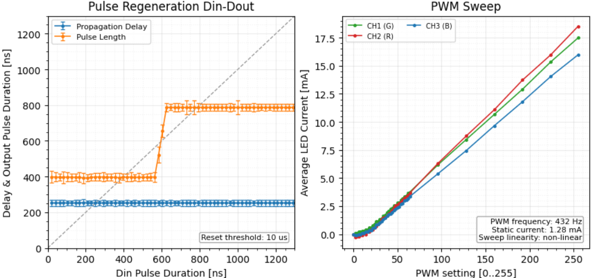
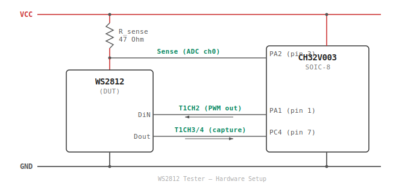

# WS2812 Tester

Automated characterization of WS2812-family addressable LEDs using a CH32V003 microcontroller.

The firmware drives a single WS2812 from the CH32V003's timer and DMA peripherals, measures the LED's response, and streams structured results over the debug interface. A companion Python GUI parses the logs and presents timing plots, current sweeps, and derived metrics.

---
> **Note**: This project including firmware, analyzer and documentation (excluding this note) was fully generated with Agentic AI: Claude Code (Opus 4.6) and Codex (GPT-5.3-Codex) based on the instructions in outline.md and subsequential prompting. The measurements were, of course, performed manually. Take note that the PWM frequency test can be inaccurate under some circumstances.
---


## What It Measures

| Test | Method | Key Output |
|------|--------|------------|
| **Bit timing (txH sweep)** | Sweeps the data-line high-time from ~21 to 1333 ns and captures the retransmitted output | Propagation delay, pulse duration, 0/1 threshold, jitter |
| **Reset time** | Linear scan for the minimum idle gap that resets the LED's shift register | Reset threshold in us |
| **PWM frequency** | Lights one LED channel and measures the supply current waveform with ADC + autocorrelation (two-pass: fast then slow fallback) | Internal PWM frequency in Hz |
| **LED current** | Sweeps each color channel across 39 duty steps, measuring average VCC shunt-drop at each point | Per-channel I vs duty curve, on-current, linearity |

### Example Output for original WS2812B 



## Hardware Setup



R_sense is in series on the WS2812 VCC supply (high-side current sense). The CH32V003 measures `Vdrop = VCC - V_sense` across the shunt to derive current. The MCU is powered directly from VCC (not through R_sense).

| Signal | Pin | Port | Function |
|--------|-----|------|----------|
| DiN | 1 | PA1 | Timer PWM output to WS2812 data input |
| Dout | 7 | PC4 | Timer capture from WS2812 data output |
| Sense | 3 | PA2 | ADC input — voltage at WS2812 side of R_sense |

## Quick Start

### Build and flash firmware

```bash
cd firmware
git submodule update --init     # fetch ch32v003fun SDK
make flash                      # build and program via WCH-LinkE
```

### Capture a test log

```bash
make monitor >log.txt
```

Edit the `Device` section fields in the firmware source before flashing to identify the device under test (manufacturer, type, LCSC part number, channel order).

### Analyze results

```bash
python3 analyzer/app.py
```

Select a log file from the dropdown. The tool shows a summary table, interpretation notes, and timing/current plots. Place a `.png` or `.jpg` with the same name as the log file in `testlogs/` to display a device photo in the Image tab.

## Repository Structure

```
firmware/
  ws2812test.c          Single-file firmware (CH32V003, ~1100 lines C)
  Makefile              Build via ch32v003fun SDK
  funconfig.h           SDK configuration (default 48 MHz HSI)
  ch32v003fun/          ch32v003fun SDK (git submodule)

analyzer/
  app.py                Python/Tkinter log analyzer GUI

testlogs/
  *.txt                 Captured test logs (one per device)
  *.png                 Optional device photos (matched by filename)
```

## Test Results

| Device | Manufacturer | Order | Reset (us) | PWM (Hz) | I_max/ch (mA) |
|--------|-------------|-------|-----------|----------|---------------|
| WS2812B | Worldsemi | GRB | 10 | 432 | 19.9 |
| WS2812B-B | Worldsemi | GRB | 238 | 2074 | 16.4 |
| WS2812D-F5 | Worldsemi | RGB | 122 | 2032 | 18.2 |
| WS2812E | Worldsemi | GRB | 244 | 2047 | 17.5 |
| WS2812E-V5 | Worldsemi | GRB | 230 | 541 | 14.6 |
| SK6112-RG | Opsco | RGB | 204 | 1675 | 13.8 |
| SK6812 | Opsco | GRB | 44 | 1155 | 11.4 |
| TX1812CXA | TCWIN | GRB | 60 | 1336 | 12.0 |
| TX1812CXD | TCWIN | GRB | 70 | 741 | 15.8 |
| TX1818CXJ | TCWIN | RGB | 60 | 2854 | 8.2 |
| LTST-G563 | LITEON | RGB | 50 | 2928 | 7.3 |
| DY-S505016 | TONYU | GRB | 64 | 935 | 12.9 |

## Requirements

- **Firmware**: `riscv64-unknown-elf-gcc` toolchain, WCH-LinkE programmer
- **Analyzer**: Python 3.7+, tkinter, matplotlib (optional, for plots), Pillow (optional, for JPEG image display)

## License

This project is licensed under the MIT License. See [LICENSE](LICENSE) for details.
