# High-Level Findings

A quick summary of findings after testing various ARGB LEDs using the [WS2812 tester](https://github.com/cpldcpu/WS2812Tester).

## Worldsemi WS2812

### WS2812B (Original from 2014)

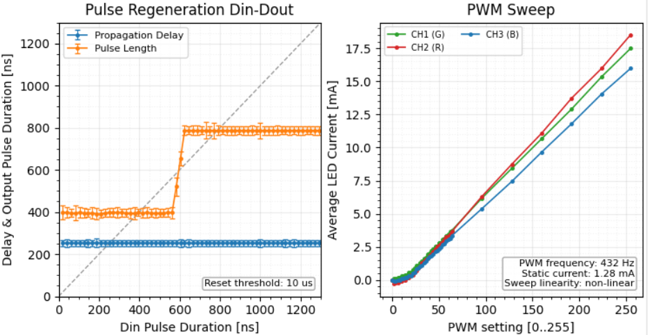

- Excellent signal regeneration with a very sharp transition from Lo to Hi timing (see [in-depth investigation](https://cpldcpu.github.io/2014/01/14/light_ws2812-library-v2-0-part-i-understanding-the-ws2812/)).
- PWM is 432 Hz (flickery).
- Reset timing is very short (unstable).
- Nonlinear PWM behavior (see [description](https://cpldcpu.github.io/2022/08/15/does-the-ws2812-have-integrated-gamma-correction/)).

### WS2812B-V5

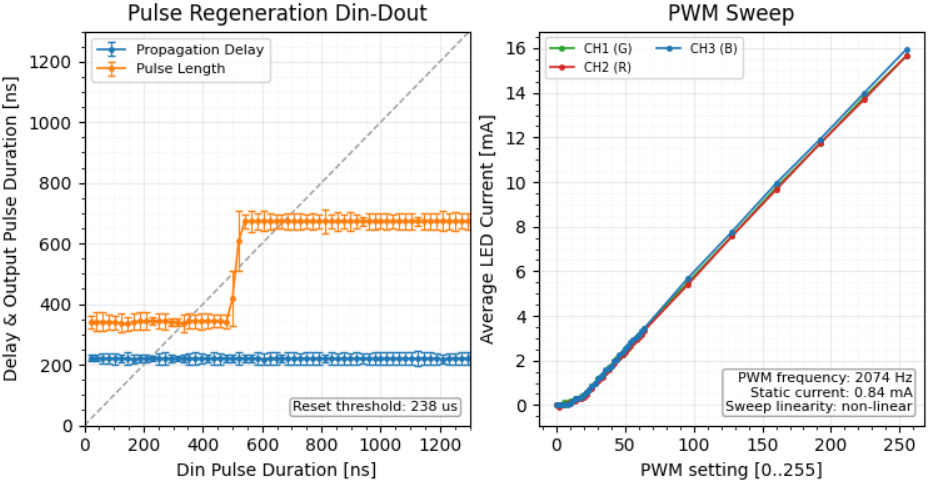 
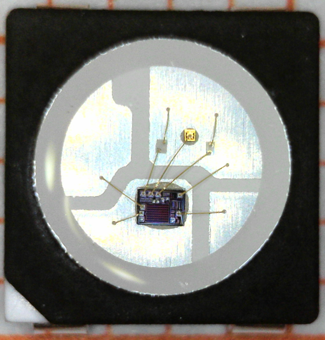 

This variant is called "V5" by Worldsemi and appears to be an optimized, smaller version of the original die.

 - Data signal regeneration still works in the same way.
 - Reset timing is now increased to >200 µs for better system robustness.
 - Nonlinear PWM behavior remains, but PWM frequency has been increased to ~2 kHz to reduce flicker.
 - Power consumption is slightly reduced.
 - Oscilloscope measurements show significantly reduced emissions on the power lines for this variant.

## SK6812

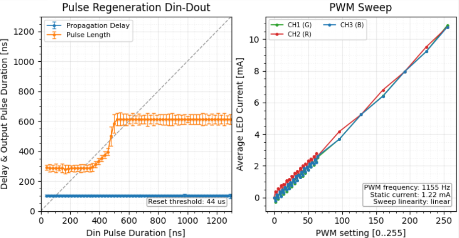 [Test Data](../testlogs/SK6812Gen1.txt)

This is a very common WS2812 clone. There are at least three generations of this controller IC, which were subsequently reduced in die size.

 - Linear PWM behavior.
 - Some differences in data regeneration.

The data regeneration works differently from the WS2812. There is a region for input pulses between 400–500 ns where signal regeneration is not stable. However, since the output timing of "LO" pulses never increases in duration, the system is ultimately still stable.

The photo below shows the DY-S505016, which appears to have one of the newest generations of the SK6812 controller, measuring 0.37 × 0.48 mm (≈ 0.18 mm²).

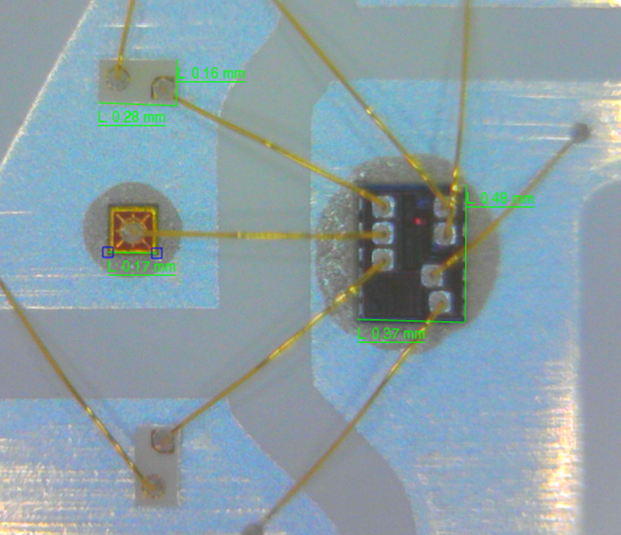 

 

## TX1812 variants

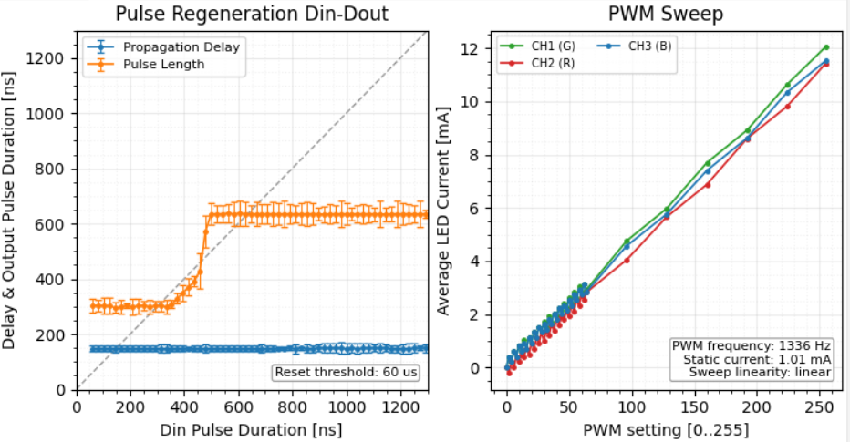

This controller appeared much later than the two above but seems to be widely used by smaller Chinese LED packagers such as TCWIN, TONYU, and others.

It behaves very similarly to the SK6812 but is noticeably noisier electrically. I believe it is based on a fully clocked digital transceiver; the WS2812 and, to some extent, the SK6812 use self-timed state machines.

It is notable for its extremely small size (0.350 × 0.370 mm ≈ 0.13 mm²) and its characteristic bond pad pattern.

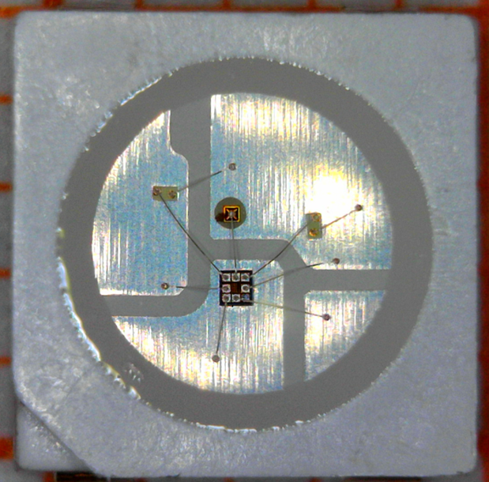 

 

### SK6112 (Using AP6112 controller)
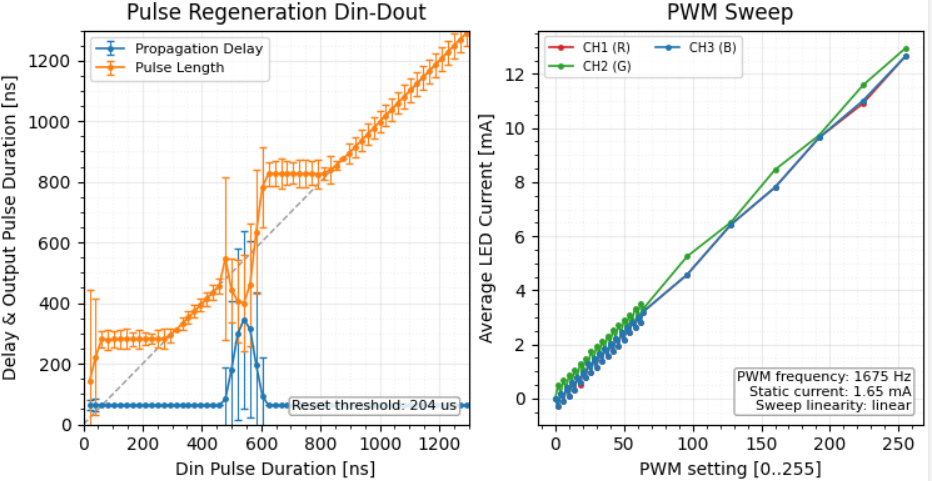 

This LED comes with a Gen2 ARGB controller, which I analyzed in detail [here](https://github.com/cpldcpu/Gen2-Addressable-RGB/blob/main/docs/Gen2_ARGB_protocol_analysis.md).

The PWM behavior is unremarkable. However, the transceiver exhibits several odd behaviors. There is only a very narrow region where it correctly regenerates the Lo and Hi pulses; in other regions it simply forwards the pulse from the input.

In addition, there is a region of indeterminate behavior between the Lo and Hi timings. Based on detailed oscilloscope investigations (some shown below), I believe this is caused by a combination of combinatorial and asynchronously clocked logic.

In any case, this does not look like a robust transceiver and is likely prone to glitches and EMI emissions due to oscillations.

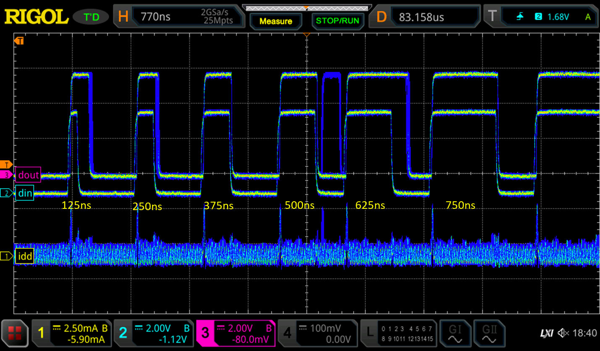 

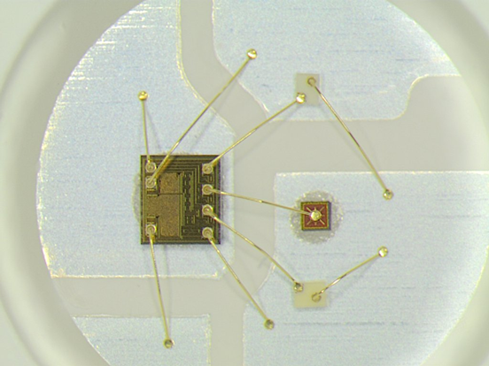 

 

## Lite-On LTST-G563

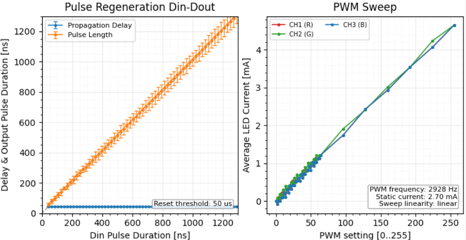 

This controller is found in an ARGB LED from Lite-On. It does not seem to be widely used, and the LEDs are comparatively more expensive without offering clear differentiation.

The transceiver does not appear to regenerate the signal; it forwards it to the output with some delay.

This is a poor design choice, as it is prone to EMI and stability issues. Considering that these LEDs appeared years after the original WS2812, it is puzzling how this design was adopted.

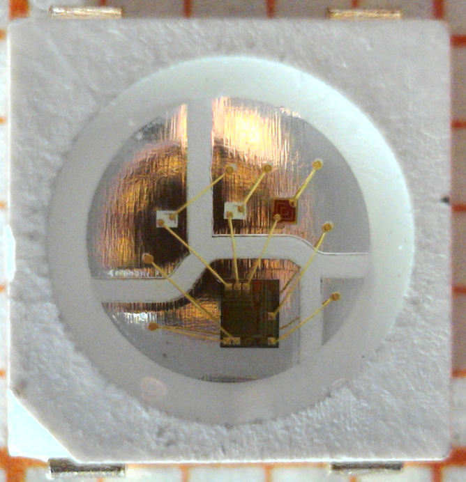 

 

